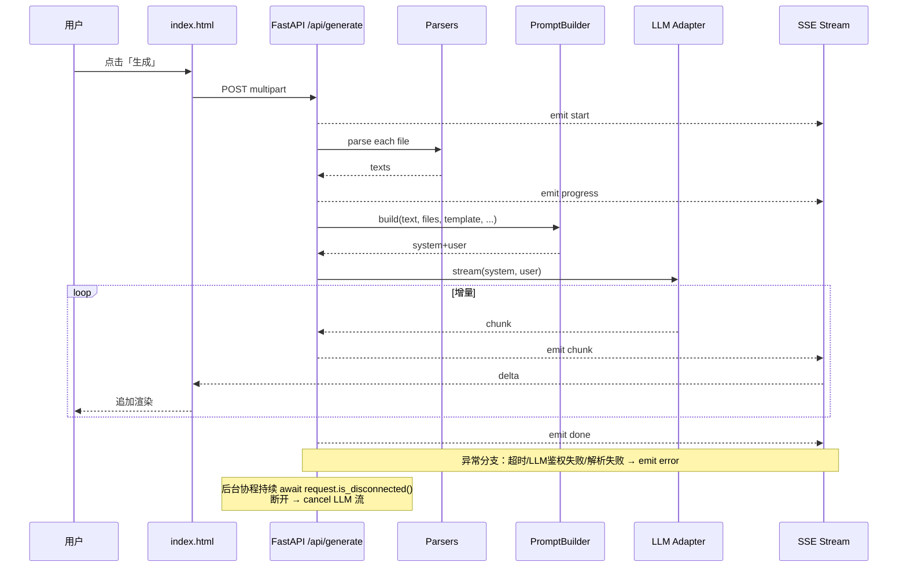

# PRD Forge — 系统架构（ARCHITECTURE）

> 配套文档：`docs/PRD-backend.md`（需求） · `prd-template.md`（输出模板） · `SKILL.md`（转换规则）

## 1. 实现方案总览
核心思路：FastAPI 路由层 → 文件解析器 → 提示词构建器（载入 SKILL.md + prd-template.md）→ LLM 适配器抽象（可插拔）→ SSE 流式响应。

```mermaid
graph TD
  Client[浏览器 index.html] -->|POST /api/generate<br/>multipart/form-data| Router[FastAPI Router]
  Router --> Parsers[FileParser 链<br/>md/txt/docx/pdf]
  Parsers --> PromptBuilder[PromptBuilder<br/>注入 SKILL + 模板]
  PromptBuilder --> Adapter[BaseLLMAdapter]
  Adapter --> Provider[LLM Provider<br/>OpenAI/Claude/...]
  Provider -->|AsyncIterator[str]| SSE[SSE EventSource]
  SSE --> Client
```

## 2. 技术栈与依赖
（列出每一项 + 版本下限即可，不要铺长文）

fastapi>=0.110
uvicorn[standard]>=0.27
python-multipart>=0.0.9
httpx>=0.27
sse-starlette>=2.0
pydantic>=2.6
pydantic-settings>=2.2
python-docx>=1.1
pypdf>=4.0
（运行在 Python 3.11+）

## 3. 目录结构
`prd-forge-backend/` 根目录下：
- `app/__init__.py`
- `app/main.py` — FastAPI 入口、CORS、启动期载入 SKILL/模板
- `app/config.py` — pydantic-settings 读 env
- `app/routers/generate.py` — `/api/generate` 端点
- `app/parsers/__init__.py`
- `app/parsers/base.py` — `FileParser` 抽象
- `app/parsers/md.py` / `txt.py` / `docx.py` / `pdf.py` — 各自实现
- `app/llm/__init__.py`
- `app/llm/base.py` — `BaseLLMAdapter.stream()`
- `app/llm/openai_compat.py` — 通用 OpenAI-compatible 实现
- `app/llm/factory.py` — `LLM_PROVIDER` → 适配器
- `app/prompts/builder.py` — system + user 拼装
- `app/prompts/skill_loader.py` — 启动期读 SKILL.md 与 prd-template.md
- `app/models/sse.py` — 5 种事件 Pydantic 模型
- `app/models/request.py` — `GenerateRequest`（含 text/files/template/language/detail/role/feature_name）
- `app/errors.py` — 统一错误码常量
- `tests/` — pytest 用例
- `requirements.txt` / `.env.example` / `README.md`

## 4. 数据结构与接口
### 抽象
- `class FileParser(Protocol): def parse(self, content: bytes, filename: str) -> str`
- `class BaseLLMAdapter(ABC): @abstractmethod async def stream(self, system: str, user: str) -> AsyncIterator[str]`

### GenerateRequest
字段（与前台 form-data 一一对应）：
- `text: str`
- `files: list[UploadFile]`
- `template: str`（默认 "standard"）
- `language: str`（默认 "zh"）
- `detail: Literal["concise","standard","full"]`（默认 "standard"）
- `role: str | None`（如 "产品经理"）
- `feature_name: str | None`

### SSE 事件
| event | data 字段 | 含义 |
|---|---|---|
| `start` | `{request_id, ts}` | 受理 |
| `progress` | `{stage, percent, message}` | 解析 / 构 prompt 进度 |
| `chunk` | `{delta}` | 增量文本 |
| `done` | `{request_id, total_chars, duration_ms}` | 完成 |
| `error` | `{code, message, retriable}` | 任意阶段失败 |

`code` 取值：`INVALID_FILE_TYPE` / `FILE_TOO_LARGE` / `FILE_PARSE_FAILED` / `LLM_AUTH` / `LLM_TIMEOUT` / `LLM_UPSTREAM` / `CLIENT_DISCONNECTED` / `INTERNAL`

## 5. 时序图


## 6. 关键设计决策
- **LLM 抽象**：`BaseLLMAdapter` 隔离具体 provider，便于切换 OpenAI/Claude/自建
- **错误码解耦 HTTP 状态**：401/超时/解析失败均返回 200 + `error` 事件，前台根据 `code` 决定文案
- **客户端断开取消**：每 chunk 前 `await request.is_disconnected()`，断则 `asyncio.cancel`
- **模板/SKILL 启动期读**：减少每请求 I/O
- **截断标注**：单文件 >50K 字符截断并加 `<ai_inferred>文件过长，已截断</ai_inferred>`
- **拼接顺序**：用户文本 → 附件 1 → … → 附件 n（按上传顺序）

## 7. 配置与安全
`.env.example`：
```
LLM_PROVIDER=openai
LLM_API_KEY=sk-...
LLM_BASE_URL=https://api.openai.com/v1
LLM_MODEL=gpt-4o-mini
LLM_TIMEOUT_S=120
LLM_FIRST_TOKEN_TIMEOUT_S=30
MAX_FILE_SIZE_MB=20
MAX_FILE_CHARS=50000
CORS_ORIGINS=http://localhost:5173
```

启动校验：缺 `LLM_API_KEY` 直接 fail-fast。文件大小硬限 20MB（中间件拦截），超过返回 SSE `error.code=FILE_TOO_LARGE`。CORS 默认 `http://localhost:5173`。

## 8. 共享知识（跨文件约定）
- 所有 SSE 事件用 `sse-starlette.ServerSentEvent`，data 序列化为 JSON
- 错误码常量集中在 `app/errors.py`，路由层只 `raise`，由全局 handler 转 SSE
- 日志前缀 `[request_id]`，`request_id = uuid.uuid4().hex`
- 内部异常必须被 `try/except` 转 SSE error，**不允许逃逸到 HTTP 层**
- 5 种事件名（start/progress/chunk/done/error）字符串集中在 `app/models/sse.py` 顶部常量

## 9. 待明确事项
1. 流式协议：默认 SSE；是否需要 WebSocket fallback？（建议仅 SSE）
2. 请求级重试：LLM 5xx 是否自动重试 1 次？（建议否，让用户手动点重试）
3. 结果缓存：按 (template, role, hash(texts)) 缓存？建议 P1 再说
4. 并发限制：单 worker 协程数上限？（uvicorn 默认即可）
5. 限流：是否需要按 IP 限流？（P1 再说）
